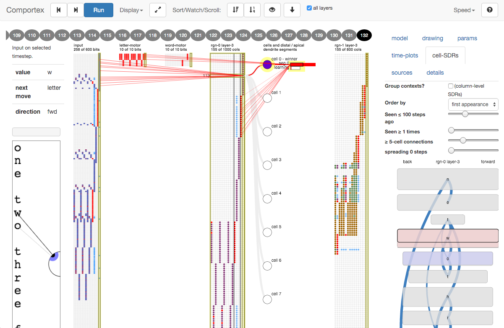
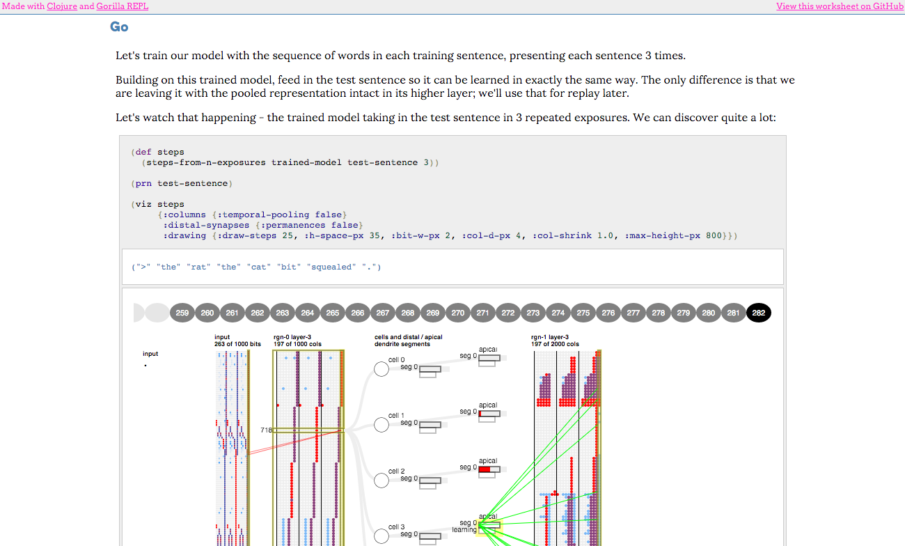

# Sanity

A web-based visualization layer for HTMs.

It works with:

- [Comportex](http://github.com/htm-community/comportex/)
- [NuPIC](https://github.com/numenta/nupic) via [sanity-nupic](https://github.com/htm-community/sanity-nupic)

For original motivation see [this blog
post](http://floybix.github.io/2014/07/11/visualization-driven-development-of-the-cortical-learning-algorithm/).

## The Runner

See it in action in [the online demos](https://htm-community.github.io/sanity/).

<a href="https://htm-community.github.io/sanity/"></a>

Sanity runs HTM models from the browser with interactive
controls. The model state from recent timesteps is kept, so you can step
back in time. You can inspect input values, encoded input bits, and the
columns that make up cortical layers. Within a column you can inspect
cells and their distal dendrite segments. Feed-forward and distal synapses
can be shown.

Kept timesteps are shown in a row at the top of the display.
Below that, the blocks represent input fields (squares) and
layers of cortical columns (circles). Depending on the display mode,
these may be shown in 2D grids from a single time step, or as one
vertical line per timestep, allowing several time steps to be shown
in series. Also, summarised time series are shown in the 'plots' tab.

Sanity can run HTM models:

- Inside the browser
- On a remote / localhost server

## The Notebook

Sanity interactive visualizations are also available in notebook
form, similar to IPython Notebook or Mathematica. It builds on
[Gorilla REPL](https://github.com/JonyEpsilon/gorilla-repl).

<a href="http://viewer.gorilla-repl.org/view.html?source=gist&id=95da4401dc7293e02df3&filename=seq-replay.clj"></a>

The notebook:

- Is a fun-filled way to drive and present HTM models
- Is a launchpad for Sanity runners
- Is [built for blogging](https://github.com/htm-community/sanity/wiki/Putting-notebooks-on-the-web).
  Interactive graphics are saved as images in the state that you left them.

Some cool examples:

- [Predicting power consumptions with HTM](http://mrcslws.com/gorilla/?path=hotgym.clj)
  by Marcus Lewis
- [Sequence replay in HTM](http://viewer.gorilla-repl.org/view.html?source=github&user=htm-community&repo=sanity&path=examples/worksheets/seq-replay.clj)
  by Felix Andrews

## Usage

Get [Leiningen](http://leiningen.org/) first.

Clone [Comportex](http://github.com/htm-community/comportex/), and
install (this command installs to your local Maven repository,
`~/.m2`. Once we make a release this step will not be needed.):

```
cd comportex
lein install
```

Clone Sanity, and then build it:

```
cd sanity
lein do clean, cljsbuild once demos
```

Start a REPL:

```
lein repl
```

From the REPL, start a notebook:

```clojure
(start-notebook)
```

You can now launch it in a web browser. The notebook will show you how
to launch your own Sanity runner.

## Online demos

To host [the online demos](https://htm-community.github.io/sanity/) locally,
do a `cljsbuild`, as above.

Now open `public/demos/*.html` in a web browser.
Each HTML page loads the corresponding model defined
in `examples/demos/sanity/demos/`.


## Hello

* [Gitter chat](https://gitter.im/htm-community/sanity)
* or email or github issues.


## License

Copyright © 2015-2016 Marcus Lewis and Felix Andrews

Copyright © 2014 Felix Andrews

Distributed under your choice of
* the Eclipse Public License, the same as Clojure.
* the [GNU Affero General Public Licence, Version 3](http://www.gnu.org/licenses/agpl-3.0.en.html), the same as NuPIC.
